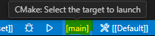

[](https://github.com/sappho192/CppCMakeVcpkgTemplate/actions/workflows/hosted-ninja-vcpkg_submod.yml)
[](https://github.com/sappho192/CppCMakeVcpkgTemplate/actions/workflows/hosted-pure-workflow.yml)

# A C++ project template based on CMake and vcpkg

- [A C++ project template based on CMake and vcpkg](#a-c-project-template-based-on-cmake-and-vcpkg)
- [1. Description](#1-description)
- [2. Key features:](#2-key-features)
- [3. GitHub Action workflows](#3-github-action-workflows)
- [4. Rationale](#4-rationale)
- [5. Setup Guide](#5-setup-guide)
  - [5.1 Windows-specific setup guide](#51-windows-specific-setup-guide)
    - [5.1.1 Install Build Tools for Visual Studio 2022](#511-install-build-tools-for-visual-studio-2022)
    - [5.1.2 Install CMake \& Ninja](#512-install-cmake--ninja)
    - [5.1.3 Open VSCode from Developer terminal for Visual Studio](#513-open-vscode-from-developer-terminal-for-visual-studio)
  - [5.2 Setting up VSCode Extensions](#52-setting-up-vscode-extensions)
- [6. Build, Debug, and Test](#6-build-debug-and-test)
  - [6.1 How to build](#61-how-to-build)
  - [6.2 How to debug](#62-how-to-debug)
  - [6.3 How to run test](#63-how-to-run-test)
- [7. Integrated Development Environment (IDE) Support](#7-integrated-development-environment-ide-support)
- [8. License](#8-license)

# 1. Description

This repository contains a `C++` based project template that leverages [vcpkg](https://github.com/microsoft/vcpkg) and [CMake](https://www.cmake.org)'s [CMakePresets.json](https://cmake.org/cmake/help/latest/manual/cmake-presets.7.html) to build and test `C++` source code.

Supports `Linux`/`macOS`/`Windows` on `x64` and `arm64` platforms.

`vcpkg` is driven to use its [binary caching](https://learn.microsoft.com/en-us/vcpkg/users/binarycaching) feature storing the content in the GitHub Action cache, hence speeding up workflows by reusing previously built packages.

# 2. Key features:

- `CMakePresets.json` allows to run the same build either _locally on your IDE_ and on _GitHub runners_.
- `vcpkg` greatly helps in pulling and building the needed dependencies (e.g. libraries) which are cached for reuse on GitHub Action cache.

# 3. GitHub Action workflows

The repository provides also two GitHub workflows to build the project on [GitHub runners](https://github.com/actions/runner). Both builds and tests the project using `vcpkg` and `CMake`, the only key difference is their implementation:

- [hosted-pure-workflow.yml](.github/workflows/hosted-pure-workflow.yml): it is a __pure__ workflow which does not use unneeded GitHub Actions that cannot run locally on your development machine. On the other hand it is directly using the `CMake`, `Ninja`, `vcpkg` and the `C++ build` tools.
- [hosted-ninja-vcpkg_submod.yml](.github/workflows/hosted-ninja-vcpkg_submod.yml): it is a concise workflow based on the custom GitHub Actions [get-cmake](https://github.com/lukka/get-cmake), [run-vcpkg](https://github.com/lukka/run-vcpkg) and [run-cmake](https://github.com/lukka/run-cmake) which simplify and shorten the workflow verbosity while adding some goodies like vcpkg binary caching stored on GH's cache and inline error annotations.

# 4. Rationale

The main idea of this `C++` project template is to show how to obtain a _perfectly reproducible_ software development process that can be run anywhere without any difference and no surprises, either locally using your preferred tools/IDE, either remotely on build agents typically used for continuous integration.

# 5. Setup Guide

## 5.1 Windows-specific setup guide

If you are developing in Linux or macOS, skip to [Section 5.2](#52-setting-up-vscode-extensions).

### 5.1.1 Install Build Tools for Visual Studio 2022

If you have already installed Visual Studio 2022, you can skip this part.

- Go to https://visualstudio.microsoft.com/downloads/
- In `All Downloads`, open up `Tools for Visual Studio` and download `Build Tools for Visual Studio 2022`
- Install the downloaded file

### 5.1.2 Install CMake & Ninja

- Install CMake (with adding PATH) [[Download](https://cmake.org/download/)]
- Install Ninja build tool using winget:
  - `winget install Ninja-build.Ninja`

### 5.1.3 Open VSCode from Developer terminal for Visual Studio

> [!IMPORTANT]  
> To properly build the project, you should **always** run VSCode from Developer terminal for Visual Studio.  
> Follow the guide below firmly.  

- [**IMPORTANT**] If you are to build x86 binary,
  - Run `launch_devtools_x86.bat`
- [**IMPORTANT**] If you are to build x64 binary,
  - Run `launch_devtools_x64.bat`
- Run `code .`

Now you can build and run the project! Keep in mind you should always open the project like this way.

(If you clone this repository and open with plain VSCode, you will see following error after all:

```
[cmake] CMake Error: CMake was unable to find a build program corresponding to "Ninja Multi-Config".  CMAKE_MAKE_PROGRAM is not set.  You probably need to select a different build tool.
[cmake] CMake Error: CMAKE_C_COMPILER not set, after EnableLanguage
[cmake] CMake Error: CMAKE_CXX_COMPILER not set, after EnableLanguage
```

In this case, you **should remove the `builds` directory** and run the VSCode by launching the `launch_devtools_x**.bat` mentioned above.

## 5.2 Setting up VSCode Extensions

Go to extensions tab and install following extensions:

- C/C++
- C/C++ Extension Pack
- CMake
- CMake Langugage Support
- CMake Tools

After you install the above extensions and select in the status bar the CMake preset (e.g. `ninja-multi-vcpkg`), as show in the following image:


# 6. Build, Debug, and Test

Before build or debug, click the following button to choose the target:



Then choose the target:


## 6.1 How to build

- Open the command palette(`ctrl+shift+p`)
- Run `CMake: Build` to build all targets
- Run `CMake: Build target` to build the target currently selected

## 6.2 How to debug

- Open the command palette(`ctrl+shift+p`)
- Run `CMake: Debug`

## 6.3 How to run test

- Open the command palette(`ctrl+shift+p`)
- Run `CMake: Run Tests`

# 7. Integrated Development Environment (IDE) Support

The major `C++` IDEs should already support `CMakePresets.json` and require no particular configuration.

For example [Visual Studio Code](https://code.visualstudio.com/) with the [CMake Tools extension](https://marketplace.visualstudio.com/items?itemName=ms-vscode.cmake-tools) let you to open the root folder of this repository, and select in the status bar the CMake preset (e.g. `ninja-multi-vcpkg`), as show in the following image:


<br>

# 8. License

All the content in this repository is licensed under the [MIT License](LICENSE.txt).

Copyright © 2024 Luca Cappa, Taein Kim
